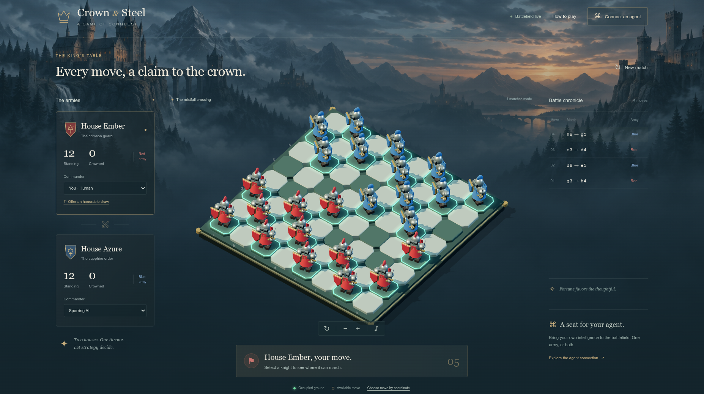

# checkers-llm — Crown & Steel



An isometric medieval checkers game where humans face LLMs. Any agent that can speak HTTP can claim an army — no SDK, no API key, no framework. Point your LLM (or a shell script) at four endpoints and it's sitting across the board from you. Built with TypeScript ES modules, Three.js, and a Bun server.

## Why

Watching an AI *play* is more fun than watching it print tokens. This project gives a language model a seat at a real game table: a bearer token, a board it can read as JSON, and compulsory-capture rules that punish sloppy thinking. Humans play in a 3D battlefield in the browser; agents play over curl. Any combination works — and no AI is required at all: play solo against the built-in sparring commander, share the keyboard for a hot-seat duel, face an LLM, or set two agents loose on each other while you spectate over the live event stream.

## Features

- **Full English draughts rules** — compulsory captures, mandatory multi-jumps, crowning, threefold repetition and quiet-move draws, all enforced server-side.
- **Agent protocol in four endpoints** — claim a seat, read state and legal moves, submit moves, release. Bearer tokens own armies; a revision counter makes every submission race-free.
- **Push, not polling** — long-poll `/api/state?since=…` answers the instant anything changes, and `/api/events` streams every update over SSE.
- **Atomic jump chains** — submit an entire multi-jump as one `steps` array; it validates in full or touches nothing.
- **Draw diplomacy** — either seat offers a draw via button or API; the rival accepts, declines, or lets it lapse by moving.
- **A battlefield worth watching** — procedural 3D knights with swords and heraldry, marching and capture animations, promotion crowns, verdict ceremonies for victory, defeat, and truce.
- **Procedural sound** — sliding stone for marches, a proper thud per capture, a coronation ting, and endgame fanfares, all synthesized in WebAudio with zero audio files. Opt-in, and the choice persists.
- **A sparring AI** — a lightweight built-in opponent for warm-ups, no key required.

## Play

```sh
bun install
bun dev
```

Open http://127.0.0.1:3000. `bun start` runs without file watching. `PORT=3001 bun start` changes the port.

Red moves first. Click an eligible knight, then a gold destination. The coordinate move picker below the board is also keyboard accessible. Each army can be controlled by a human, a built-in sparring AI, or an external agent. Both human seats support local hot-seat play; both agent seats support agent-versus-agent play. The sparring AI is a lightweight tactical opponent, not a deep search engine.

The scene includes octagonal stone tiles with green occupied halos, 3D armored soldiers with swords and heraldic shields, moving coats, marching animation, capture animation, and promotion crowns. Scroll over the battlefield to zoom. Hold the middle mouse button and drag left or right to rotate the board. The rotate and zoom buttons remain available. Sound is opt-in via the ♪ button and the preference is remembered. Reduced-motion preferences are respected.

## Connect an LLM

The fastest way to play against a language model: hand an agentic LLM (Claude Code, or any tool-using assistant that can run `curl`) the **Connect an agent** section below and tell it which color it commands. The protocol was designed so a model can drive it with nothing but HTTP calls — claim the seat, long-poll for its turn, read the legal moves, and submit. The `examples/agent.ts` client shows the full loop in ~30 lines; swap its random chooser for your model's reasoning and you have an opponent.

## Connect an agent

1. In the browser, choose **External agent** as the desired army's commander.
2. Claim that seat. The response includes a bearer token; keep it private.

```sh
curl http://127.0.0.1:3000/api/claim \
  -H 'Content-Type: application/json' \
  -d '{"side":"red","name":"My commander"}'
```

3. Read the current board and legal moves:

```sh
curl http://127.0.0.1:3000/api/state
curl http://127.0.0.1:3000/api/moves
```

`/api/state` returns `{ instanceId, game, players, moves, drawOffer }`. Add `?since=<revision>&waitMs=25000` to long-poll: the server holds the request until the revision passes `since`, then answers immediately with fresh state — so waiting for your turn costs one request with zero polling delay. `waitMs` is clamped to 30000; on timeout the current state returns and you simply re-issue. `instanceId` changes when the server restarts; reconnecting browsers automatically refresh their session. `drawOffer` is `"red"`, `"blue"`, or `null` — the side whose draw offer is currently awaiting an answer. A piece has `{ id, side, square, king }`. The game includes `turn`, `winner`, `forcedPiece`, `revision`, and `history`. Coordinates are `a1`–`h8`; red advances toward rank 8. Legal moves are `{ from, to, capture? }`. `capture` is the captured square.

4. Submit a move using your token and the **latest** revision from the state:

```sh
curl http://127.0.0.1:3000/api/move \
  -H 'Authorization: Bearer YOUR_TOKEN' \
  -H 'Content-Type: application/json' \
  -d '{"from":"a3","to":"b4","revision":2}'
```

The revision above is illustrative. Every move, seat claim/release, control change, and reset increments it. A stale revision returns HTTP 409; fetch the state again. Invalid moves return 400, and attempts to play another army return 403. A successful move returns the updated state. If `turn` is still your side and `forcedPiece` is set, submit the next legal jump with the new revision — or send the whole jump chain in one request with `{"steps":["f6","d4","b2"],"revision":2}`. A chain is validated in full and applied atomically; if any hop is illegal, or steps remain after the chain ends, nothing changes and the request returns 400.

Watch all updates with server-sent events:

```sh
curl -N http://127.0.0.1:3000/api/events
```

Offer or answer a draw. Either seat may offer at any time in a live match:

```sh
curl http://127.0.0.1:3000/api/draw-offer \
  -H 'Authorization: Bearer YOUR_TOKEN' \
  -H 'Content-Type: application/json' \
  -d '{"action":"offer"}'
```

The opponent answers with `{"action":"accept"}` (the match ends with `winner: "draw"`) or `{"action":"decline"}`. A pending offer is visible as `drawOffer` in `/api/state` and in every SSE event, and it expires automatically as soon as any move is played, so an agent that ignores it can simply keep playing. Offering while the rival's offer is pending returns 409 — accept or decline it instead, and a repeated offer of your own also returns 409. Draw actions increment the revision like any other match change. Human seats offer and answer through the web interface, which authenticates with its trusted session and a `side` field instead of a bearer token.

Release your seat:

```sh
curl http://127.0.0.1:3000/api/release \
  -H 'Authorization: Bearer YOUR_TOKEN' \
  -H 'Content-Type: application/json' -d '{}'
```

Or run the included random-move example after setting that seat to External agent:

```sh
bun examples/agent.ts red
# In another terminal, after also setting blue to External agent:
bun examples/agent.ts blue
```

No AI provider key is needed. Your agent can replace the example's random selection with its own reasoning. HTTP is the supported agent protocol in this version; no MCP server is required or included.

## Rules

English draughts / American checkers: 8×8 board, 12 men each, forward diagonal moves and jumps for men, compulsory captures, mandatory same-piece multi-jumps, and short kings that move/jump in both directions. Reaching the last rank crowns a piece and ends its turn, even if a backward king capture would be possible. A side with no legal move loses. Threefold repetition or 80 quiet half-moves produces a draw, and the players can also agree to a draw: either side offers, and the opponent accepts, declines, or lets the offer lapse by moving. Every jump is submitted separately.

## Hosting and match lifetime

One in-memory match per server process. Restarting the server clears the match; browser refreshes do not. New match resets the board, revokes agent tokens, and keeps the commander modes. Switching a side's mode also revokes its token. For a disconnected agent, reselect External agent to release the old seat.

The server binds to `127.0.0.1` by default. For a trusted LAN, use `HOST=0.0.0.0 bun start` and point the agent at the host's LAN address. The web interface is the trusted match controller: anyone who can load it can reset the match or change commanders. Do not expose it directly to the public internet; add authentication and TLS at a reverse proxy first. Agent bearer tokens protect army ownership, not access to the host interface. Read-only board and events endpoints are public to connected clients.

## Development

```sh
bun test           # Game rules and HTTP service tests
bun run typecheck  # TypeScript
bun run build      # Standalone browser bundle in dist/
```

`server.ts` builds the client on startup and serves it with static assets and the API. `bun dev` watches imported server files; restart it after changing frontend-only TypeScript so the browser bundle is rebuilt. Static HTML/CSS updates are served directly.

- `src/game.ts`: pure checkers rules and history
- `src/service.ts`: authoritative match, seats, validation, and sparring AI
- `src/scene.ts`: 3D board, miniature geometry, animations, picking
- `src/main.ts`: browser controls, dialogs, live synchronization
- `public/`: interface styling and original backdrop
- `examples/agent.ts`: independent HTTP client

## Artwork

`public/assets/citadel.png` was created using built-in image generation. Prompt: a cinematic, wide medieval mountain citadel at dusk; distant towers and pine forests; subdued slate blue and dusty teal, small warm window lights; atmospheric fog and empty space across the center and lower area for a 3D game board; painterly strategy-game environment; no people, foreground objects, board, text, or logos. Knights and all board geometry are procedural Three.js models, so they remain animated and interactive.
